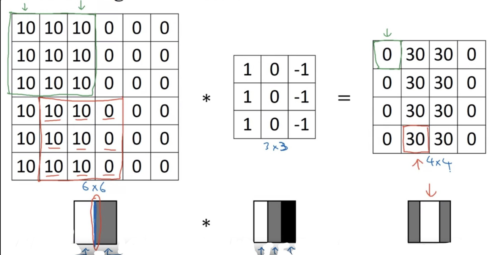
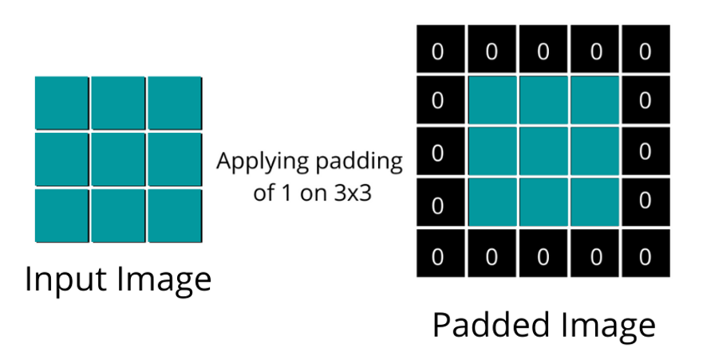
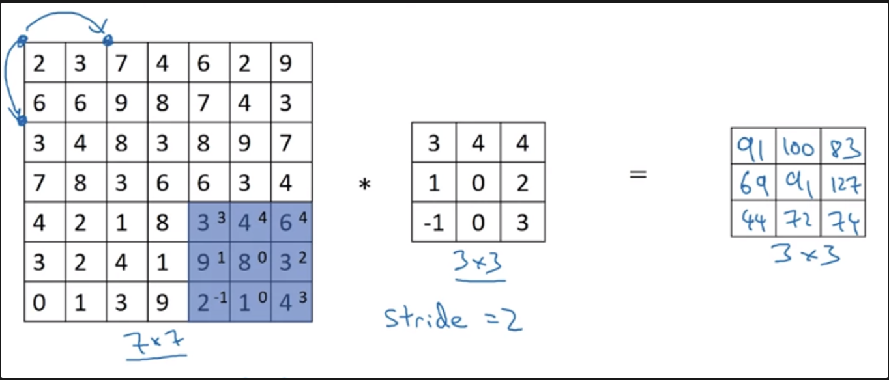
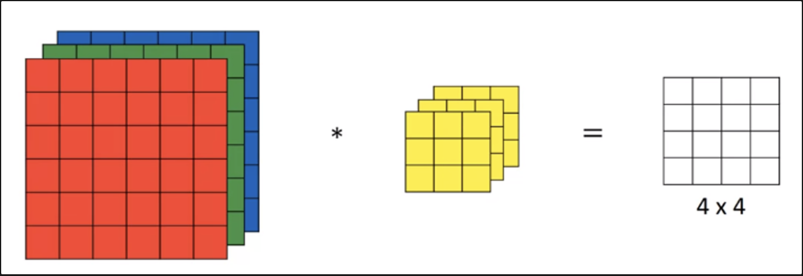
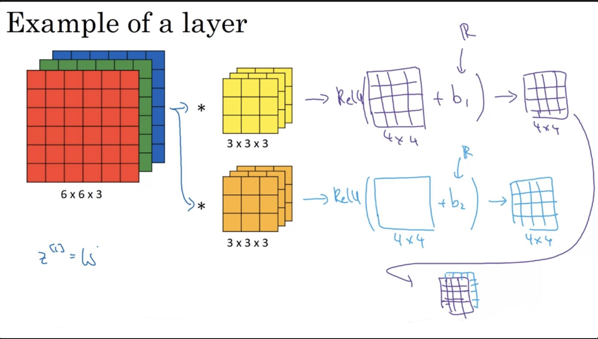
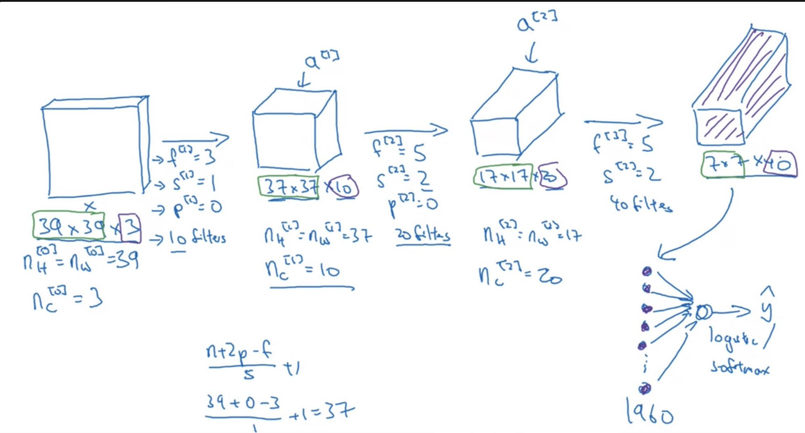
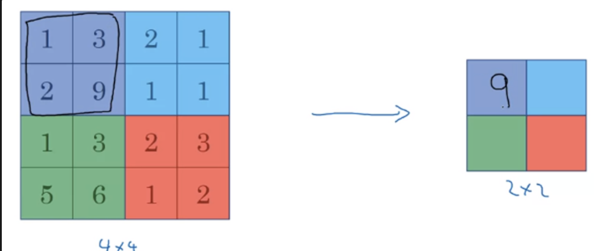
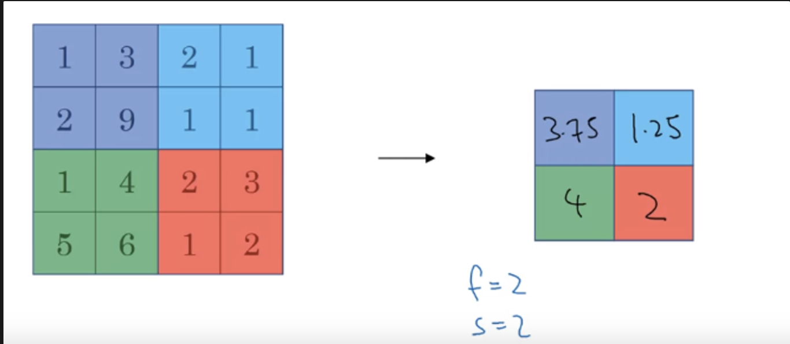

# Convolution Neural Network

- The convolution operation is one of the fundamentals blocks of a CNN. One of the examples about convolution is the image edge detection operation.

- Early layers of CNN might detect edges then the middle layers will detect parts of objects and the later layers will put the these parts together to produce an output.

## Edge Detection

- In an image we can detect vertical edges, horizontal edges, or full edge detector.

## Padding 
- **Definition**: Padding in Convolutional Neural Networks (CNNs) refers to the technique of adding zeros (or other fixed values) around the border of an input image or feature map.

- **Types of Padding**:
    - **Zero Padding (Same Padding)**: This is the most common form where zeros are added around the edges.

    - **Valid Padding (No Padding):** This approach does not add any padding to the input. 

## Strided Convolution

- **Definition**: This stride, the step size with which the filter moves, effectively skips over pixels or features, leading to a downsampling of the input. 

## Convolutions over volumes

- We see how convolution works with 2D images, now lets see if we want to convolve 3D images (RGB image)
- We will convolve an image of height, width, # of channels with a filter of a height, width, same # of channels. Hint that the image number channels and the filter number of channels are the same.
- We can call this as stacked filters for each channel!

## One Layer of a Convolutional Network

## Simple Convolution Network Example

.png)

- The deeper CNN $\implies$ the smaller activation and the larger amount of layers

- Types of layer in a convolutional network:
    - Convolution.  #Conv
    - Pooling  #Pool
    - Fully connected  #FC

## Pooling layers

- **Defintion**: Pooling, also known as subsampling or downsampling, reduces the spatial size of the feature maps, thereby decreasing the number of parameters and computation in the network

### Max Pooling: 

### Average Pooling: 

## Why convolutions?

- Two main advantages of Convs are:
    - A feature detector (such as a vertical edge detector) that's useful in one part of the image is probably useful in another part of the image.
    - In each layer, each output value depends only on a small number of inputs which makes it translation invariance.