# Deep convolutional models: case studies

## Classic Networks

### LeNet-5
- The goal for this model was to identify handwritten digits in a 32x32x1 gray image. Here is the drawing of it:

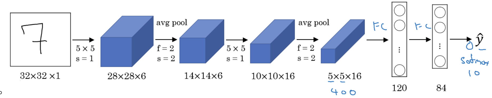

- This model was published in 1998. The last layer wasn't using softmax back then.

- It has 60k parameters.

- The dimensions of the image decreases as the number of channels increases.

- Sequence: 
```
Conv => Pool => Conv => Pool => FC => FC => SoftMax 
```
(this type of arrangement is quite common).

- The activation function used in the paper was Sigmoid and Tanh. Modern implementation uses RELU in most of the cases.

### AlexNet

- The model's goal was to tackle the ImageNet challenge, which involves classifying images into 1000 distinct classes.

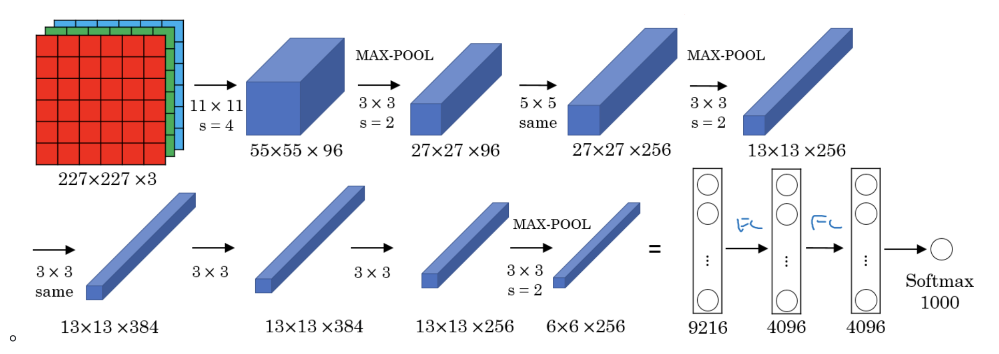

- Here's a summary of the model's architecture:
```
Conv => Max-pool => Conv => Max-pool => Conv => Conv => Conv => Max-pool => Flatten => FC => FC => FC => Softmax
```

- This model is similar to LeNet-5 but scaled up significantly in size and complexity.

- It boasts 60 Million parameters, a substantial increase from the 60k parameters of LeNet-5.

- The RELU activation function is used throughout the network for non-linearity.

### VGG-16

- VGG-16 is a modification for AlexNet.
- It aims for simplicity, reducing the number of hyperparameters by focusing on having only these blocks:
  - **CONV**: 3 x 3 filter, s = 1, padding = 'same'
  - **MAX-POOL**: 2 x 2, s = 2
- Here's the architecture outline:


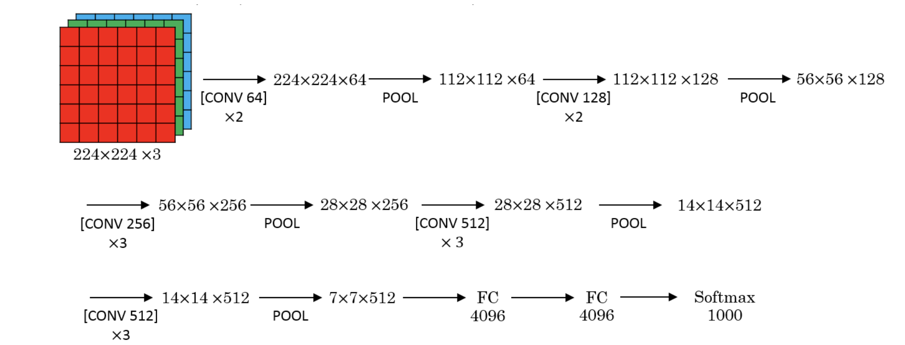

## Residual Networks (ResNets)

- Very, very deep NNs are difficult to train because of vanishing and exploding gradients problems.

### Residual block

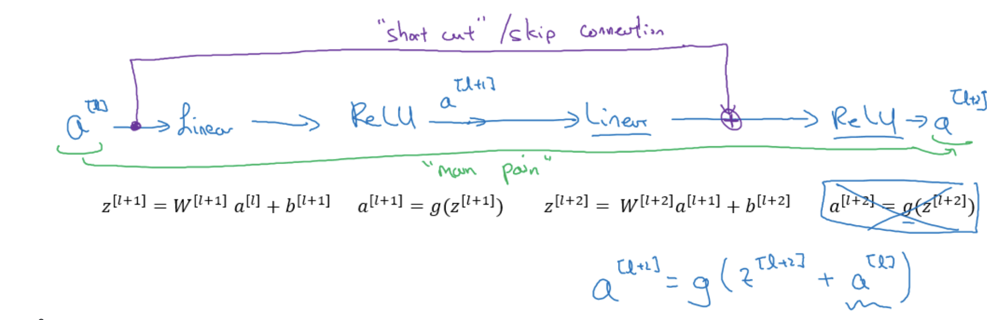

- ResNets are built out of some Residual blocks.

- They add a shortcut/skip connection before the second activation.

### Residual Network

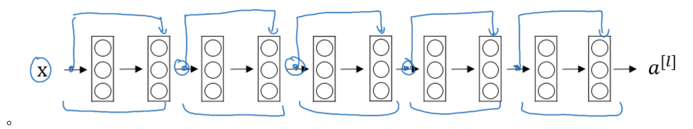

- These networks can go deeper without hurting the performance. In the normal NN - Plain networks - the theory tell us that if we go deeper we will get a better solution to our problem, but because of the vanishing and exploding gradients problems the performance of the network suffers as it goes deeper. 

- Residual blocks with skip connections facilitate the network's learning by making it easier to learn the identity function. This implies that even if extra layers do not contribute to improving accuracy, they won't hurt it either.

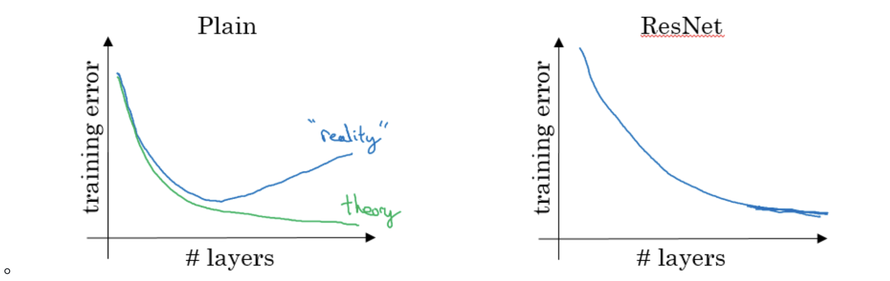

### Residual Block Types
- **Identity block**:

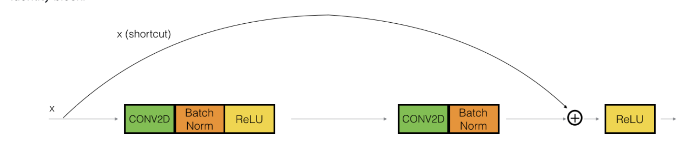

- Hint the conv is followed by a batch norm BN before RELU. Dimensions here are same.
- This skip is over 2 layers. The skip connection can jump n connections where n>2

- **Convolutional block**:

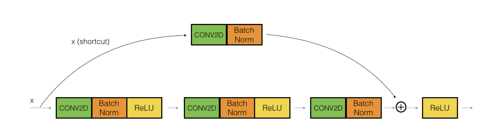

- The conv can be bottleneck 1 x 1 conv

## Network in Network and 1 X 1 convolutions

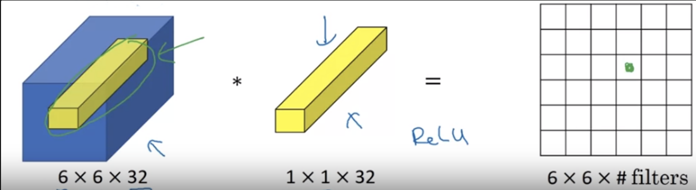

- A 1 x 1 convolution is useful when:
    
    - We want to shrink the number of channels. We also call this feature transformation.
    
    - We will later see that by shrinking it we can save a lot of computations.

    - Adding 1x1 convolutions increases the depth of the network, which can lead to more complex and potentially more accurate models

## Inception network motivation

- Interception design to use all layers at once. 

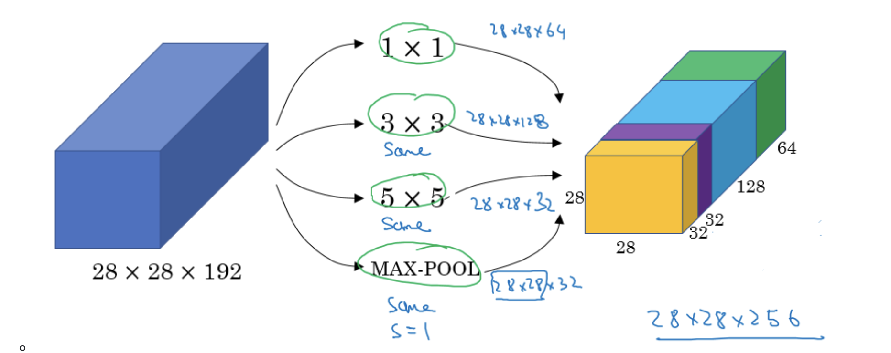

### Problems and Solve

- The computational cost of Interception Network is too large $\implies$ we can use 1x1 Conv to reduce it and won't hurt the performance. 

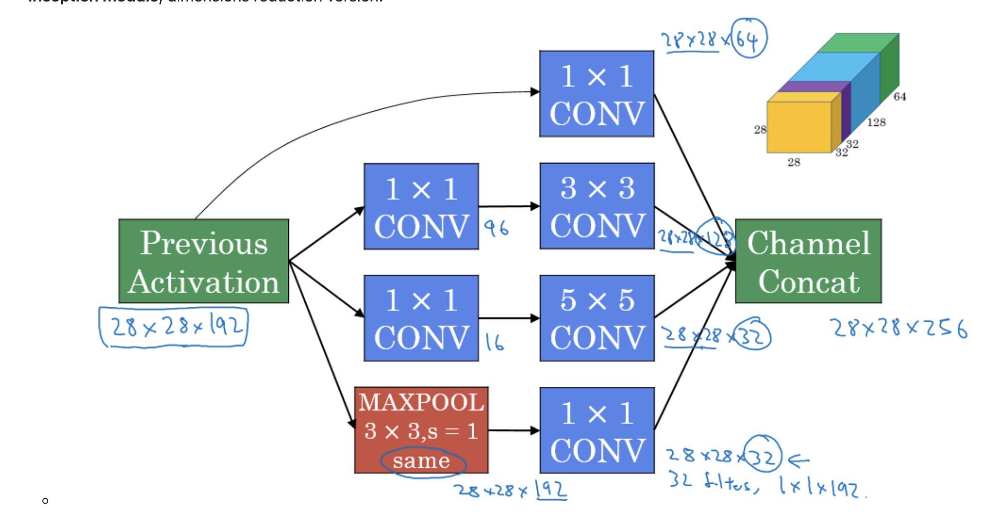

## State of Computer Vision

- For a specific problem, we may have little data for it or lots of data.
- If your problem has a large amount of data, researchers tend to use:
  - Simpler algorithms.
  - Less hand engineering.
- If you don't have that much data, people tend to try more hand engineering. Like choosing a more complex NN architecture.

### Tips for doing well on benchmarks/winning competitions:
- **Ensembling**:
  - Train several networks independently and average their outputs. Merging down some classifiers.
  - After you decide the best architecture for your problem, initialize some of that randomly and train them independently.

- **Multi-crop at test time**:
  - Run classifier on multiple versions of test versions and average results.
  - There is a technique called 10 crops that uses this.

### Use open source code
- Use architectures of networks published in the literature.
- Use open source implementations if possible.
- Use pretrained models and fine-tune on your dataset.
