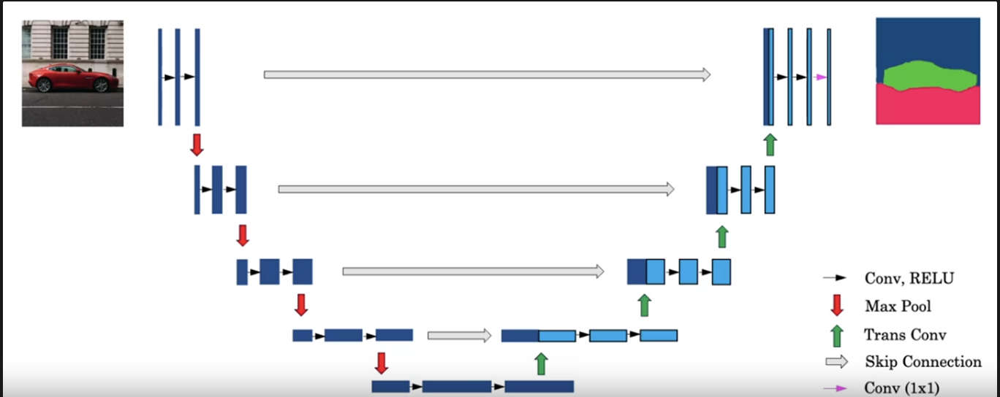

# Object detection

## Object Localization

- **Classification with localization**:
    
    - Given an image we want to learn the class of the image and where are the class location in the image. We need to detect a class and a rectangle of where that object is. Usually only one object is presented.

- **Object detection**:

    
    - Given an image we want to detect all the object in the image that belong to a specific classes and give their location. An image can contain more than one object with different classes.

- **Semantic Segmentation**:

    
    - We want to Label each pixel in the image with a category label. Semantic Segmentation Don't differentiate instances, only care about pixels. It detects no objects just pixels.

    - If there are two objects of the same class is intersected, we won't be able to separate them.

- **Instance Segmentation**: 

    

    - This is like the full problem. Rather than we want to predict the bounding box, we want to know which pixel label but also distinguish them.

$\therefore$ To make classification with localization we use a Conv Net with a softmax attached to the end of it and a four numbers bx, by, bh, and bw to tell you the location of the class in the image. The dataset should contain this four numbers with the class too.

  $y = \begin{bmatrix} p_c \\ b_x\\b_y\\b_h\\b_w\\c_1\\c_2\\c_3 \end{bmatrix}$

- $P_c$: Probability of an object is presented
- $b_x, b_y$: Bounding box position
- $b_h, b_w$: Bounding box height and width
- $c_1, c_2, c_3$: The classes

- Loss Function: 

    - $ L(y',y) = $ 
    $(y1'-y1)^2\space +\space (y2'-y2)^2\space +\space ...\space if\space y1\space =\space 1$ 
    $(y1'-y1)^2\space if\space y1\space =\space 0$

## Landmark Detection
- In some of the computer vision problems you will need to output some points. That is called landmark detection.

## Object Detection

- We will use a Conv net to solve the object detection problem using a technique called the sliding windows detection algorithm. We will slide the window to each part of image to detect.

## Convolutional Implementation of Sliding Windows
- Turning FC layer into convolutional layers (predict image class from four classes)

### Convolution implementation of sliding windows:

- Say now we have a 16 x 16 x 3 image that we need to apply the sliding windows in. By the normal implementation that have been mentioned in the section before this, we would run this Conv net four times each rectangle size will be 16 x 16.

- Simply we have feed the image into the same Conv net we have trained then the output have shape (2,2,4) = 4 * (1,1,4). Each (1,1,4) equal to each output of previous Network
- Its more efficient because it now shares the computations of the four times needed.

### Problems
-  The weakness of the algorithm is that the position of the rectangle wont be so accurate. Maybe none of the rectangles is exactly on the object you want to recognize.

## Bounding Box Predictions

- We can solve the problem in previous section by YOLO algorithm

- Algorithm: 
    - Split the image into smaller box.
    - Each box will be pass into ConvNet.
    - Merging the results using predicted localization mid point.

## Intersection Over Union (IoU)

- Intersection Over Union is a function used to evaluate the object detection algorithm.

- $IOU\space =\space \frac{intersection\space area}{Union\space area}$

- If IOU >=0.5 then its good. The best answer will be 1.
- The higher the IOU the better is the accuracy.

## Non-max Suppression

- One of the problems we have addressed in YOLO is that it can detect an object multiple times.

- Non-max Suppression is a way to make sure that YOLO detects the object just once.

- We got this output: $  y = \begin{bmatrix} p_c \\ b_x\\b_y\\b_h\\b_w\end{bmatrix}$

    - Discard all boxes with Pc < 0.6
    - While there are any remaining boxes:
    - Pick the box with the largest $p_c$ Output that as a prediction.
    - Discard any remaining box with IoU > 0.5 with that box output in the previous step i.e any box with high overlap(greater than overlap threshold of 0.5).

## Anchor Boxes

- If Y = [Pc, bx, by, bh, bw, c1, c2, c3] Then to use two anchor boxes like this:
    - Y = [Pc, bx, by, bh, bw, c1, c2, c3, Pc, bx, by, bh, bw, c1, c2, c3] We simply have repeated the one anchor Y.

## **YOLO Algorithm**:

- The image is divided into an SxS grid and the algorithm processes the image only once.

- A single Convolutional Neural Network predicts multiple bounding boxes and class probabilities for those boxes simultaneously.

- Non-maximum suppression is used to merge overlapping bounding boxes based on confidence scores.

## Semantic Segmentation with U-Net

.png)

## Transpose Convolution

- **Definition**: It is often used in neural networks for tasks such as upsampling and generating higher-resolution images from lower-resolution feature maps. 

.png)

.png)

### U-Net Summary

