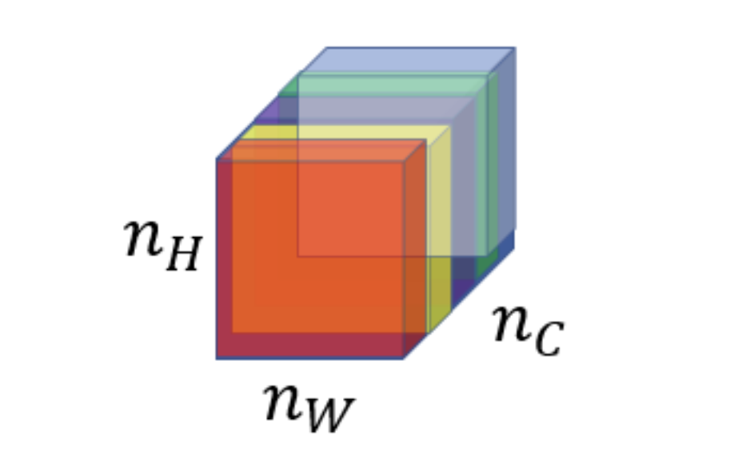

# Face recognition and Neural Style Transfer

## Face Recognition

### Face verification vs. face recognition:

- **Verification:**
  - Input: image, name/ID. (1 : 1)
  - Output: whether the input image is that of the claimed person.
  - "Is this the claimed person?"

- **Recognition:**
  - Has a database of K persons
  - Get an input image
  - Output ID if the image is any of the K persons (or not recognized)
  - "Who is this person?"

## One Shot Learning

- One of the face recognition challenges is to solve one shot learning problem.

- One Shot Learning: A recognition system is able to recognize a person, learning from one image.

- Historically deep learning doesn't work well with a small number of data.

- Instead to make this work, we will learn a similarity function:
    - d( img1, img2 ) = degree of difference between images.
    - We want d result to be low in case of the same faces.
    - We use T as a threshold for d:
        - If d( img1, img2 ) <= T Then the faces are the same.
        - Otherwise
- Similarity function helps us solving the one shot learning. Also its robust to new inputs.

## Siamese Network
- We will implement the similarity function using a type of NNs called Siamease Network in which we can pass multiple inputs to the two or more networks with the same architecture and parameters.

- We make 2 identical conv nets which encodes an input image into a vector. In the above image the vector shape is (128, )
- The loss function will be $d(x_1, x_2) = || f(x_1) - f(x_2) ||^2$

## Triplet Loss

- Triplet Loss is one of the loss functions we can use to solve the similarity distance in a Siamese network.
- Our learning objective in the triplet loss function is to get the distance between an **Anchor** image and a **positive** or a **negative** image.
  - Positive means same person, while negative means different person.
  

- Formally we want:
  - Positive distance to be less than negative distance
    - $||f(A) - f(P)||^2 <= ||f(A) - f(N)||^2$
  - Then
    - $||f(A) - f(P)||^2 - ||f(A) - f(N)||^2 <= 0$
  - To make sure the NN won't get an output of zeros easily:
    - $||f(A) - f(P)||^2 - ||f(A) - f(N)||^2 <= -\alpha$
      - Alpha is a small number. Sometimes it's called the margin.

- Then
  - $||f(A) - f(P)||^2 - ||f(A) - f(N)||^2 + \alpha <= 0$

- Final Loss function:
  - Given 3 images (A, P, N)
    - $L(A, P, N) = max(||f(A) - f(P)||^2 - ||f(A) - f(N)||^2 + \alpha, 0)$
  - $J = \sum_{i=1}^{m}L(A^{(i)}, P^{(i)}, N^{(i)})$ for all triplets of images.

- You need multiple images of the same person in your dataset. Then get some triplets out of your dataset.
  Dataset should be big enough.

## Face Verification and Binary Classification
- Instead of Triplet Loss, there's another way to learn these parameters as a straight binary classification problem. 

- Then Logistic Regression Unit: $\displaystyle\hat{y} = \sigma(\sum_{k=1}^{128}w_k|f(x^{(i)})_k - f(x^{(j)})_k| + b)$

- With this way, we need to label the dataset first: 

.png)

# Neural Style Transfer
- Neural style transfer takes a content image (C) and a style image (S) and generates the content image (G) with the style of style image.

## What are deep ConvNets learning?

- Pick a unit in layer l. Find the nine image patches that maximize the unit's activation.
- Notice that a hidden unit in layer one will see relatively small portion of NN, so if you plotted it it will match a small image in the shallower layers while it will get larger image in deeper layers.
- Repeat for other units and layers.
- It turns out that layer 1 are learning the low level representations like colors and edges.

## Cost Function

- Give a content image C, a style image S, and a generated image G:
    - $J(G) = \alpha * J(C,G) + \beta * J(S,G)$
    - $J(C, G)$: measures how similar is the generated image to the Content image.
    - $J(S, G)$: measures how similar is the generated image to the Style image.
        - alpha and beta are relative weighting to the similarity and these are hyperparameters.

- Find the generated image G:
    - Initiate G randomly
    - For example G: (100, 100, 3)
    - Use gradient descent to minimize J(G)
    - $G = G - dG$ We compute the gradient image and use gradient decent to minimize the cost function.

### Content Cost Function
- Say you use hidden layer $[l]$ to compute $Content\space Cost$.
  - If we choose $[l]$ to be small (like layer 1), we will force the network to get similar output to the original content image.
  - In practice $[l]$ is not too shallow and not too deep but in the middle.
- Use pre-trained ConvNet. (E.g., VGG network)
- Let $a(C)[l]$ and $a(G)[l]$ be the activation of layer $[l]$ on the images.
- If $a(C)[l]$ and $a(G)[l]$ are similar then they will have the same content
  - $J(C, G)$ at a layer 1 = $\frac{1}{2}||a(C)[l] - a(G)[l]||^2$

### Style Cost Function

- Define **$Style$** as correlation between activations across channels.

- Style matrix (Gram matrix):
    - Let $a^{(l)}_{[i, j, k]}$ be the activation at $l$ layer with $(i=H, j=W, k=C)$
    - Also $G^{[l]}$ is matrix of shape $n^{[l]}_c \times n^{[l]}_c$

    - $\displaystyle G^{[l](S)}_{kk'} = \sum_{i=1}^{n^{[l]}_H}\sum_{j=1}^{n^{[l]}_W}a^{[l](S)}_{ijk}\text{ }a^{[l](S)}_{ijk'}$
    - $\implies$ If k, $k^{'}$ is similar, so G will be large

    - Then at layer $l$: $J_{style}^{[l]}(S, G) = \frac{1}{(2n_{H}^{[l]}n_{W}^{[l]}n_{C}^{[l]})^{2}}\sum_k \sum_{k'}(G^{[l](S)}_{kk'} - G^{[l](G)}_{kk'})^{2}$

    - Total Cost: $J_{style}(S, G) = \sum_l\lambda^{[l]}J_{style}^{[l]}(S, G)$