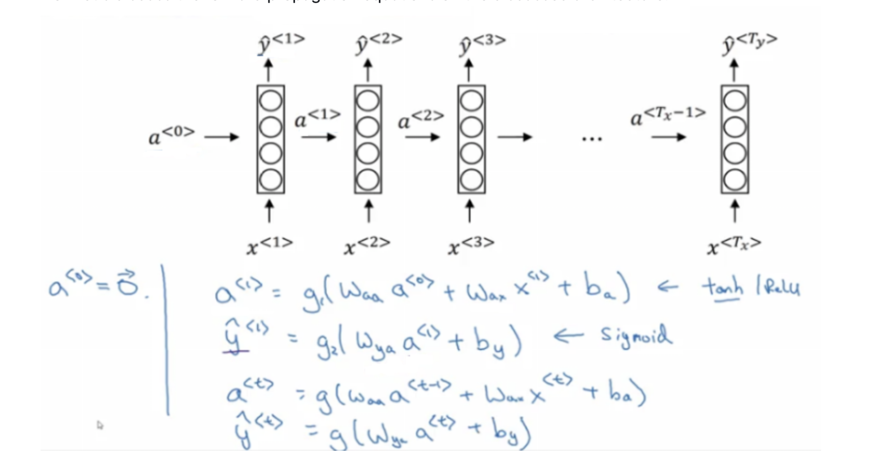
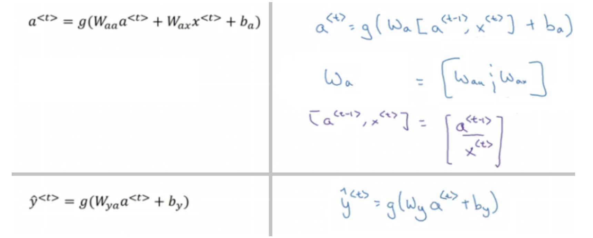
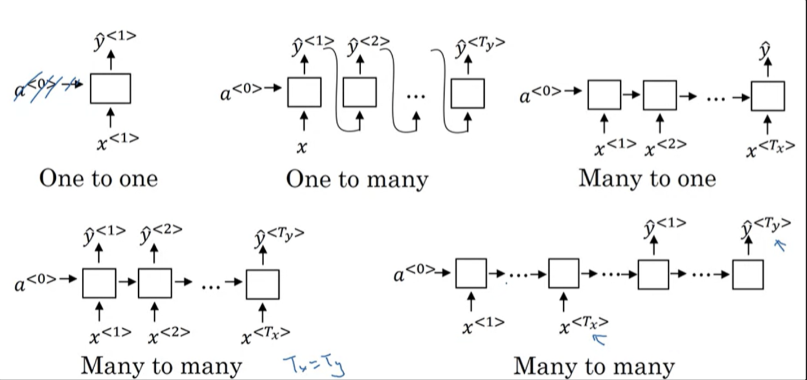
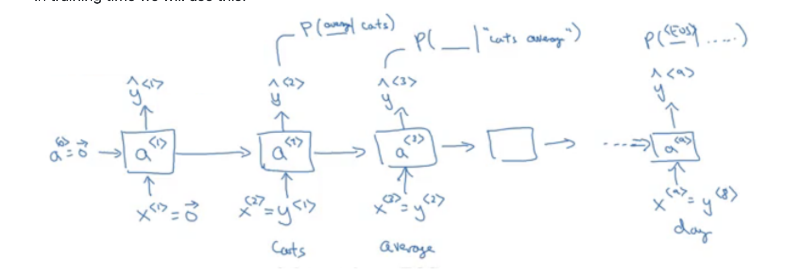
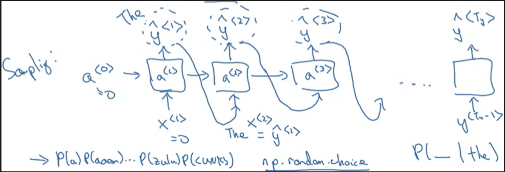
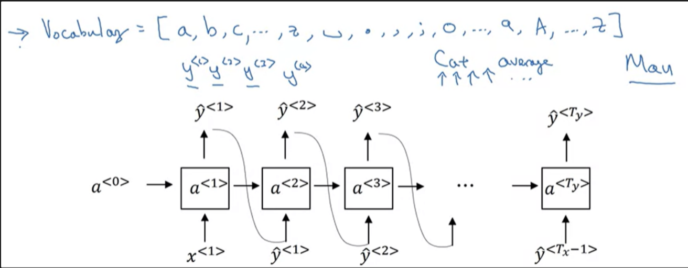
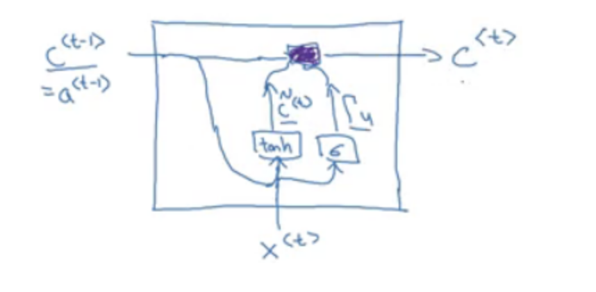
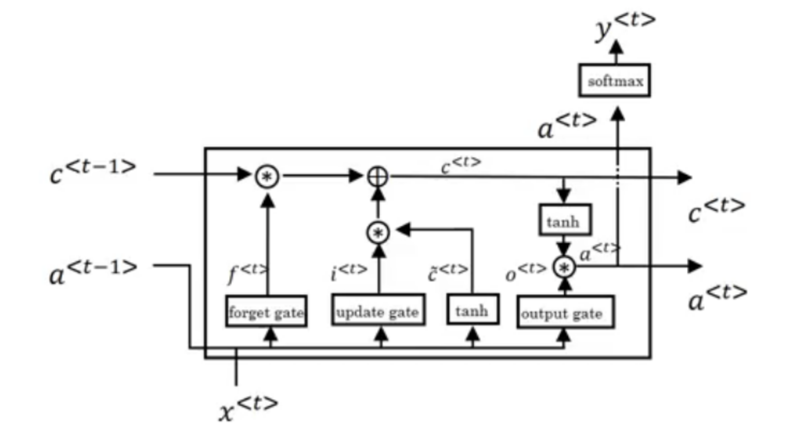
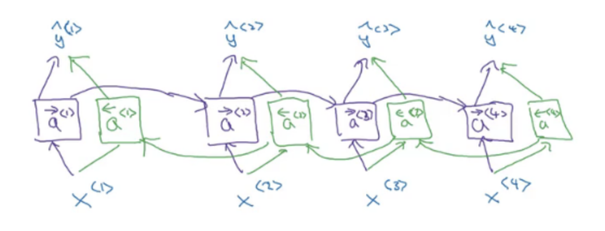
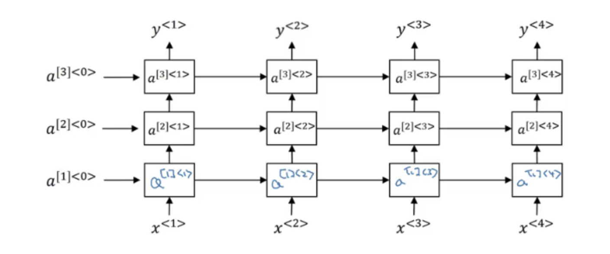

# Squence Models 
## Recurrent Neural Network Model

- **Problem with Standard Networks for Sequence Tasks:**
  - Fixed input/output sizes do not work well with variable sequence lengths.
  - Lack of feature sharing across sequence positions is inefficient.

- **Solution with RNNs:**
  - RNNs handle variable input/output lengths and share features across positions, making them ideal for tasks like name entity recognition.

### RNN Architecture

- **Loop Mechanism:**
  - Information is passed across sequence steps, allowing the network to maintain context.

- **Weight Matrices:**
  - `W_ax`: Connects input to hidden layer.
  - `W_aa`: Connects hidden layer to itself at the next time step.
  - `W_ya`: Connects hidden layer to output.

- **Initial State:**
  - Often starts with zeros but can be randomized in some cases.

- **Output Dependence:**
  - Each output $ y^{<t>} $ is influenced by the current input $ x^{<t>} $ and the previous hidden state $ a^{<t-1>} $.

### Limitations and Forward Propagation

- **Limitation:**
  - RNNs cannot learn from future elements in the sequence.

- **Forward Propagation:**
  - Uses activation functions such as tanh or ReLU for hidden states, and sigmoid or softmax for outputs depending on the task.

### Simplified RNN Notation

- **Weight Matrix Simplification:**
  - `W_a`: Stacked $ W_{aa} $ and $ W_{ax} $.
  - Input Combination: Stacked previous hidden state $ a^{<t-1>} $ and current input $ x^{<t>} $.

- **Equation Simplification:**
  - Simplifies the forward propagation equations to facilitate the development of complex RNN architectures.

### Forward Propagation and Back Propagation

### Different types of RRNs

## Language model and Sequence generation

### RNNs in Language Modeling
- RNNs excel at language model problems due to their ability to handle variable-length sequences and predict the next item in the sequence.

### What is a Language Model?
- A language model assigns probabilities to sequences of words, aiding in differentiating between similar-sounding phrases by using context.

### Purpose of Language Models
- The primary job of a language model is to assign probabilities to sequences of words, facilitating applications like speech recognition.

### Building Language Models with RNNs
- The process begins with a large text corpus that is tokenized into words. Each word is then one-hot encoded.
- Special tokens are added to the vocabulary, such as `<EOS>` for the end of a sentence and `<UNK>` for unknown words.

### Example Sentence
- For a given sentence, the RNN is trained to predict the probability of each word in the sequence like "Cats average 15 hours of sleep a day. `<EOS>`".

### Training the Model
- The RNN is trained using a loss function, specifically the cross-entropy loss, which is defined for a sequence as:

    - $L(\hat y^{<t>}, y^{<t>}) = -Σ(y_i^{<t>} * log(\hat y_i^{<t>}))$

    where $y_i^{<t>}$ is the predicted probability distribution for the correct word at time step `t`.

## Using the Model

- To predict the next word, the RNN outputs a probability distribution, and the word with the highest probability is selected.

- The probability of an entire sentence is calculated by multiplying the conditional probabilities of each word given the previous words:

    - $p(y^{1},\space y^{2},\space ...,\space y^{t})\space =\space Πp(y^{t}\space |\space y^{1},\space y^{2},\space ...,\space y^{t - 1})$

## Sampling Novel Sequences

After training a language model on a sequence, you can sample novel sequences to evaluate what the model has learned.

### Steps to Sample a Novel Sequence:

1. **Initialization:**
   - Start with `a<0>` as a zeros vector and `x<1>` as a zeros vector.

2. **Sampling:**
   - Sample a prediction randomly from the distribution obtained by `y<1>`. 
   - For example, the first word might be "The".
   - This can be implemented in Python using `numpy.random.choice(...)`.

3. **Sequence Generation:**
   - Predict the subsequent words by feeding the last predicted word back into the model.
   - Continue predicting the next word (`y<t>`) and feeding the prediction (`x<t>`) back into the model.

4. **Termination:**
   - Repeat the sampling process until the `<EOS>` token is generated or a fixed length is reached.
   - Optionally, reject any `<UNK>` tokens to avoid unknown words in the output.

### Word-Level vs. Character-Level Models:

- **Word-Level Language Model:**
  - Constructs sequences based on whole words.

- **Character-Level Language Model:**
  - Constructs sequences based on individual characters including letters, numbers, and punctuation.

### Pros and Cons:
- **Word-Level Model:**
  - Pro: No `<UNK>` tokens, as the model generates known words.
  - Con: Limited to known vocabulary.

- **Character-Level Model:**
  - Pro: Ability to generate any word, even outside the known vocabulary.
  - Con: Generates longer sequences and can be computationally more expensive and complex to train.

### Trends in NLP:
- The NLP field is shifting towards character-level models, particularly for specialized applications requiring a detailed understanding of vocabulary nuances.
  

## Vanishing and Exploding Gradients with RNNs

### Vanishing Gradients
- **Problem Definition:** Naive RNNs face the vanishing gradient problem, especially with long sequences, because gradients get progressively smaller as they propagate back in time.
- **Implications:** It's challenging for the RNN to learn long-term dependencies, as seen with difficulty in associating verbs correctly with subjects in sentences with many intervening words.
- **Example:** Differentiating between "The cat, which already ate ..., was full" and "The cats, which already ate ..., were full".

### Exploding Gradients
- **Problem Definition:** When large gradients accumulate, causing weights to update in huge leaps, potentially leading to divergent behaviors.
- **Mitigation Strategy:** Gradient clipping rescales gradients when they exceed a predefined threshold to prevent them from becoming too large.

### Solutions for Gradient Problems
- **For Exploding Gradients:**
  - Truncated backpropagation: Limiting the number of steps in which gradients are propagated back.
  - Gradient clipping: Capping the gradients during backpropagation to prevent divergence.

- **For Vanishing Gradients:**
  - Improved weight initialization: Methods like He initialization can help mitigate the issue.
  - Echo state networks: An alternative RNN architecture designed to address this problem.
  - LSTM/GRU networks: Incorporating gates that can maintain gradients over longer sequences, LSTMs and GRUs are better equipped to deal with vanishing gradients.

## Gated Recurrent Unit (GRU)

GRUs are a type of RNN architecture that are designed to mitigate the vanishing gradient problem and better retain long-term dependencies.

### Key Points

- GRUs maintain information over longer sequences, addressing the vanishing gradient problem common in standard RNNs.
- They have gating units that control the flow of information without separate memory cells, which are known as update and reset gates.
- In GRUs, $a^{t - 1} = C^{t - 1}$

### GRU Structure and Equations

****
The GRU modifies the RNN structure with:

- **Update gate $Γ_u$**: Determines the extent to which previous memory is used.
- **Reset gate $Γ_r$**: Decides how much of the past information to forget.
- **Current memory content $c̃^{<t>}$**: The combination of new input with past memory, which the reset gate affects.

- The equations governing the GRU are:
    - Update gate: $Γ_u = sigmoid(W_u \cdot [c^{<t-1>}, x^{<t>}] + b_u)$
    - Reset gate: $Γ_r = sigmoid(W_r \cdot [c^{<t-1>}, x^{<t>}] + b_r)$
    - Current memory content: $c̃^{<t>} = tanh(W_c \cdot [Γ_r * c^{<t-1>}, x^{<t>}] + b_c)$
    - Final memory at current timestep: $c^{<t>} = Γ_u * c̃^{<t>} + (1 - Γ_u) * c^{<t-1>}$

### Advantages of GRUs

- GRUs combine the forget and input gates into one update gate and often have fewer parameters than LSTMs.
- They can be computationally more efficient and are well-suited for certain tasks.

### Usage

- GRUs are widely used in language modeling and time-series prediction where long sequences of data are processed.
- Full GRUs with both update and reset gates have proven to be effective across various tasks and are considered standard in RNN architectures, along with LSTMs.

## Long Short Term Memory (LSTM)

- LSTM networks are an advanced type of RNN that are capable of learning long-term dependencies and are generally considered more powerful and versatile than GRUs.

### Key Characteristics of LSTM

- LSTMs can account for long-term dependencies in sequence data, which is challenging for basic RNNs.
- The cell state in an LSTM is denoted as $C^{<t>}$, which corresponds to $a^{<t>}$ in GRUs.

### Equations of an LSTM Unit

LSTMs use several gates to control the memory and flow of information:

- Candidate cell:
  $\tilde{C}^{<t>} = \tanh(W_C \cdot [a^{<t-1>}, x^{<t>}] + b_C)$

- Update (input) gate:
  $\Gamma_u = \sigma(W_u \cdot [a^{<t-1>}, x^{<t>}] + b_u)$

- Forget gate:
  $\Gamma_f = \sigma(W_f \cdot [a^{<t-1>}, x^{<t>}] + b_f)$

- Output gate:
  $\Gamma_o = \sigma(W_o \cdot [a^{<t-1>}, x^{<t>}] + b_o)$

- Cell state update:
  $C^{<t>} = \Gamma_u * \tilde{C}^{<t>} + \Gamma_f * C^{<t-1>}$

- Final output:
  $a^{<t>} = \Gamma_o * \tanh(C^{<t>})$

### Advantage of LSTM

- In GRUs, there is an update gate, a relevance gate, and a candidate cell variable, while in LSTMs there are update, forget, and output gates, along with a candidate cell variable.

- While GRUs are simpler and can be used to build larger networks, LSTMs provide more control and are more powerful due to their complex gate mechanism.

## Bidirectional RNN

### Definition
- BiRNNs process data in both forward and backward directions, allowing the network to have both past and future context at each time step.

### Advantages
- **Contextual Awareness**: They capture information from both past (backward pass) and future (forward pass) data points, providing a more comprehensive understanding of the sequence context.
- **Accuracy**: BiRNNs can lead to better performance on tasks like name entity recognition, where the full context of a sequence is important.

### Disadvantages
- **Full Sequence Requirement**: BiRNNs need the complete input sequence before processing, making them unsuitable for real-time applications.
- **Increased Computation**: Processing sequences in both directions doubles the computation, leading to higher computational costs and longer training times.

## Deep RNN

- With **Deep RNN**: We multiple the activation layers as image shown

