# Natural Language Processing & Word Embeddings
- Natural language processing with deep learning is an important combination. Using word vector representations and embedding layers you can train recurrent neural networks with outstanding performances in a wide variety of industries. Examples of applications are sentiment analysis, named entity recognition and machine translation.

## Introduction to Word Embeddings

### Word Representation

#### Introduction to Word Embeddings
- Revolution in NLP through deep learning, RNNs, and deep RNNs.
- Word embeddings allow algorithms to capture word analogies.

#### One-Hot Encoding
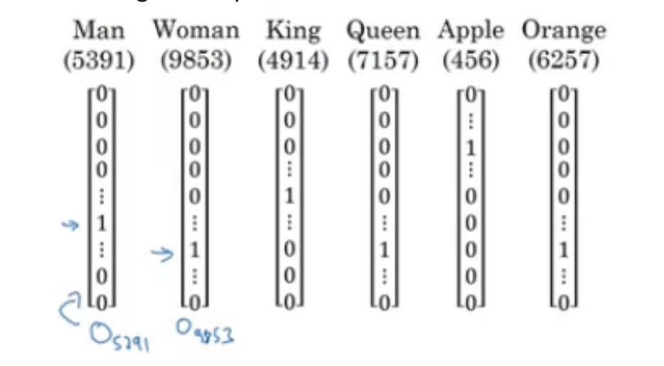
- Defined language by a vocabulary and used one-hot vectors.
- Limitations:
  - Treats words as discrete, unrelated entities.
  - Does not allow generalization across words.

#### Moving Beyond One-Hot Encoding

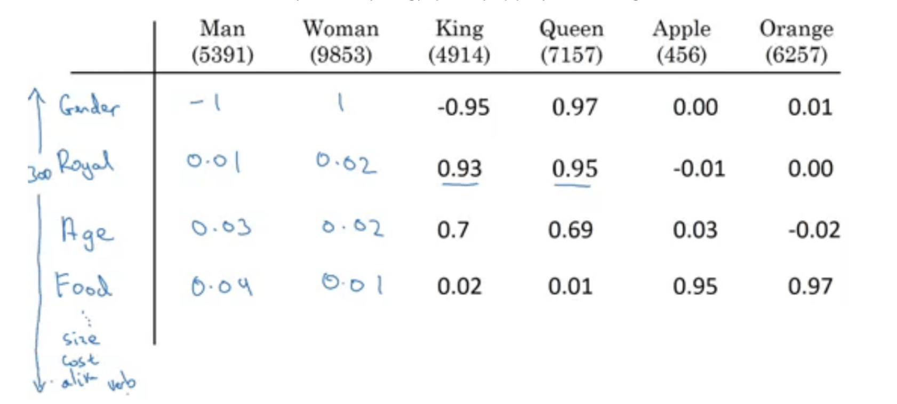

- Suggestion to use feature-rich vector representations.
- Feature vectors contain floating-point numbers representing word features.

#### Advantages of Word Embeddings
- Allows algorithms to predict related words even if not explicitly trained on them.
- Words share similar features, helping in generalizing and understanding context.

#### Visual Representation of Word Embeddings
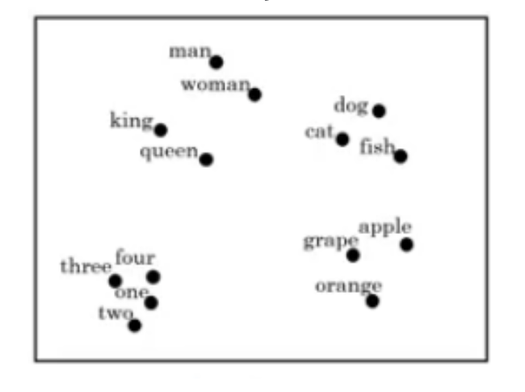
- Utilization of t-SNE to reduce word feature dimensions for visualization.
- Words with similar meanings are closer in the embedded space.

### Using Word Embeddings
#### Application in Named Entity Recognition
- Feature representations from word embeddings can be applied to tasks like named entity recognition.

#### Example of Application
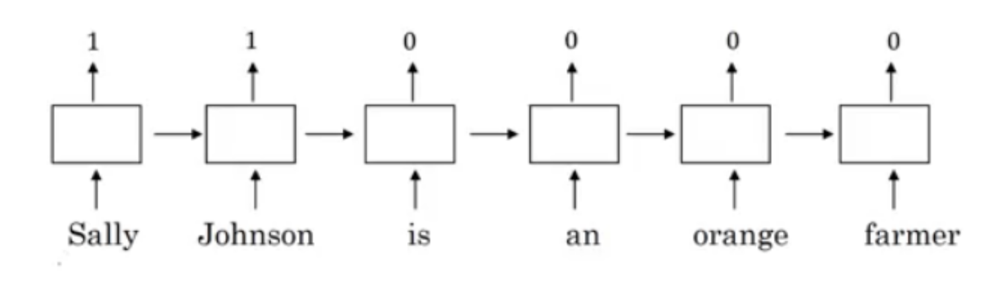
- Shows how a model can recognize "Sally Johnson" as a person's name.
- Training on sentences with named entities allows the model to recognize similar patterns with new names like "Robert Lin" or "Mahmoud Badry" even if they weren't in the training set.

#### Training and Leveraging Word Embeddings
- Word embeddings are trained on large text corpora (1–100 billion words) or can be obtained pre-trained.
- Transfer learning applies these embeddings to new tasks with potentially smaller training sets.
- Further fine-tuning of word embeddings with new data is optional.

#### Benefits of Word Embeddings
- They significantly impact tasks with smaller training sets.
- They reduce the dimensionality of the input data (from one-hot vectors to dense feature vectors).

### Properties of word embeddings
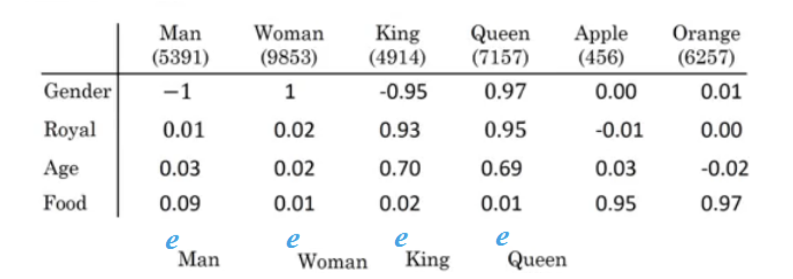

- Can we conclude this relation:
    - Man ==> Woman
    - King ==> ??

#### Mathematical Representation

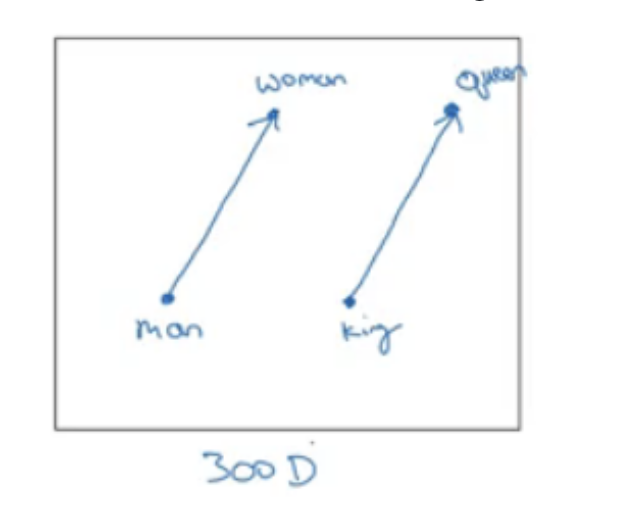

- Subtracting the vector for "man" from "woman" yields a vector representing gender difference.
    - $diff\space = \space e_{man} - e_{women}$
- Applying this vector to "king" should give us the vector for "queen".
    - $diff\space = \space e_{king} - e_{queen}$

- The problem of finding analogies can be formulated as finding the word whose embedding vector, when added to or subtracted from another, maximizes similarity. $\implies$ In this problem we need to find the vector $"queen"$ which $e_{Man} - e_{Woman} ≈ e_{King} - e_{queen}$

#### Similarity Functions
- Besides `cosine similarity`, `Euclidean distance` can also be used, typically to measure dissimilarity.

### Embedding Matrix

- An **embedding matrix** is learned during the training of word embedding algorithms.
- The matrix dimensions are based on the vocabulary size and the number of features per word.
  - Example: For 10,000 words and 300 features, the matrix $E$ will have a shape of (300, 10000).
- Each column corresponds to the embedding of a word in the vocabulary.
- Obtaining a word's embedding:
  - For a one-hot encoded word like "orange," multiply $E$ by the one-hot vector to get a (300, 1) shaped embedding.
- Initial Training:
  - The embedding matrix starts with random weights.
  - It's refined during training to represent word features effectively.

## Learning Word Embeddings: Word2Vec & GloVe

### Word2Vec

Before presenting Word2Vec, let's talk about skip-grams (This model uses the current word to predict the surrounding context words):

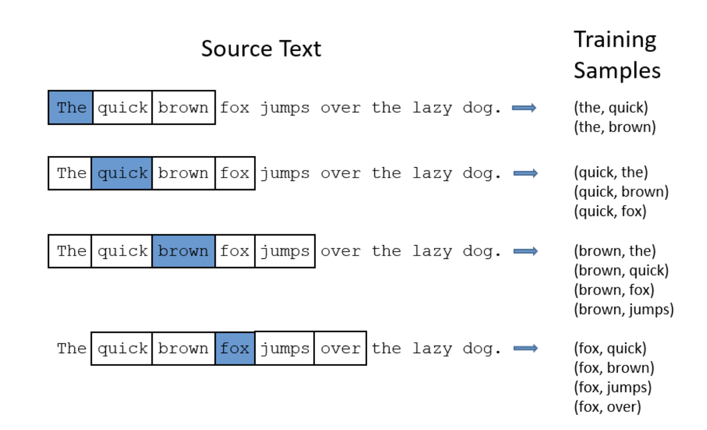

- For example, we have the sentence: "I want a glass of orange juice to go along with my cereal"
- We will choose context and target.
- The target is chosen randomly based on a window with a specific size.

| Context | Target | How far |
| ------- | ------ | ------- |
| orange  | juice  | +1      |
| orange  | glass  | -2      |
| orange  | my     | +6      |

- We have converted the problem into a supervised problem.
- This is not an easy learning problem because learning within -10/+10 words (10 - an example) is hard.
- We want to learn this to get our word embeddings model.

#### Word2Vec Model:
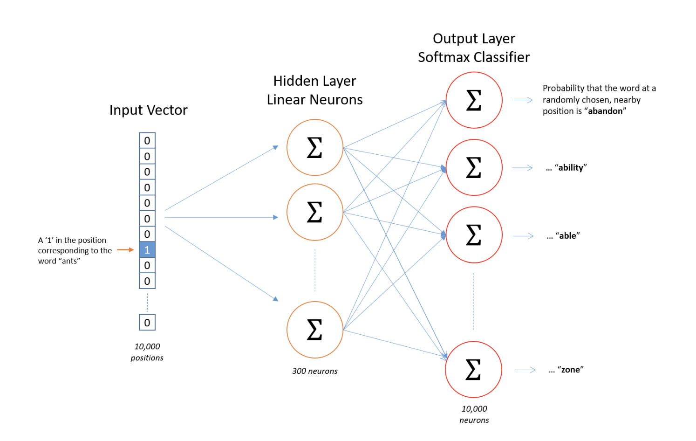
- Vocabulary size = 10,000 words
- Let's say that the context word are `c` and the target word is `t`.
- We want to learn `c` to `t`.
- We get e_c by $E \cdot o_{c}$.
- We then use a softmax layer to get P (t | c) which is ŷ.
- Also we will use the cross-entropy loss function.
- This model is called skip-grams model.

#### The last model has a problem with the softmax layer:
- $ p(t | c) = \frac{e^{\theta_t^T e_c}}{\sum_{j=1}^{10,000} e^{\theta_j^T e_c}} $
- Here we are summing 10,000 numbers which corresponds to the number of words in our vocabulary.
- If this number is larger say 1 million, the computation will become very slow.

#### Solution:
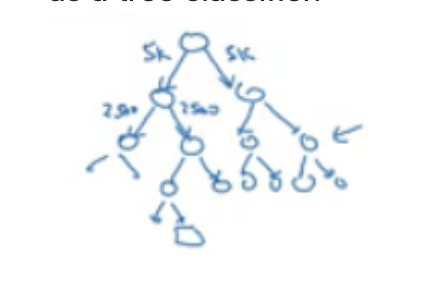
- One of the solutions for the last problem is to use "Hierarchical softmax classifier" which works as a tree classifier.
- In practice, the hierarchical softmax classifier doesn't use a balanced tree like the drawn one. Common words are at the top and less common are at the bottom.

#### Context Sampling:
- How to sample the context `c`?
  - One way is to choose the context by random from your corpus.
  - If you have done it that way, there will be frequent words like "the, of, a, and, to, ..." that can dominate other words like "orange, apple, durian,..."
  - In practice, we don't take the context uniformly random, instead there are some heuristics to balance the common words and the non-common words.

#### Negative Sampling

- Negative Sampling is a technique used to efficiently train the Skip-gram model of Word2Vec.
- It reduce amount of weights the model need to train. 

##### Positive and Negative Samples
- Positive example is generated using the same Skip-gram technique with a context window.
- Negative examples are randomly picked words from the vocabulary that are not present in the context.
- Despite "of" appearing in the same sentence, it can still be a negative sample.

| Context | Word  | Target |
|---------|-------|--------|
| orange  | juice | 1      |
| orange  | king  | 0      |
| orange  | book  | 0      |
| orange  | the   | 0      |
| orange  | of    | 0      |

##### Sampling Procedure
1. Pick a positive context word.
2. Pick a set `k` number of negative context words from the dictionary.
3. Then we just train these `k + 1` words.
- The typical ratio of negative to positive examples is recommended to be from 5 to 20 in small datasets, and 2 to 5 in larger ones.

##### Selecting Negative Samples
- The frequency of word occurrence in the corpus can influence selection.
- Over-representation of frequent words is avoided by sampling according to a specially designed equation.

### GloVe

- GloVe (Global Vectors for Word Representation) is a model for efficiently learning word embeddings by leveraging global co-occurrence statistics of words in a corpus. It's simpler than Word2Vec or Skip-Gram models, and while it may not be as widely used, it has its unique advantages.

#### Key Concepts of GloVe
- **Word-Word Co-occurrence Matrix**: GloVe builds on the insight that word co-occurrences in a corpus provide valuable semantic information. The model calculates the probabilities that a given word will co-occur with other words.
- **Symmetry in Word Representation**: The embeddings for word $ t $ (target) and word $ c $ (context) should ideally contribute equally to the model, reflecting their symmetric roles in the co-occurrence data.

#### GloVe Loss Function
- The GloVe loss function aims to minimize the difference between the dot product of the word vectors and the log of their co-occurrence probability.
- The model's objective function is to minimize the following:

    - $ J = \sum_{i,j=1}^{V} f(X_{ij}) (\theta_{i}^{T} e_{j} + b_{i} + b_{j} - \log X_{ij})^{2} $

where:
- $ X_{ij} $: The number of times word $ i $ occurs in the context of word $ j $.
- $ f(X_{ij}) $: A weighting function that helps to address the variance in word co-occurrence counts.
- $ \theta_{i} $, $ e_{j} $: The word vectors for the target and context words.
- $ b_{i} $, $ b_{j} $: Scalar bias terms for the target and context words.
- The weighting function $ f(x) $ is designed to:
  - Mitigate the noise from rare co-occurrences.
  - Prevent the overweighting of frequent words.
  - Account for the 'log(0)' issue when $ X_{ij} = 0 $, which means there's no co-occurrence.

#### Using GloVe
- When using GloVe for the first time, it's recommended to start with a pre-trained model to understand how it performs.
- With enough data, one can train a GloVe model to capture domain-specific semantics.
- Word embeddings are computationally intensive to train, so most practitioners prefer using pre-trained embeddings.

## Sentiment Classification

- Sentiment classification is a process in natural language processing (NLP) where the sentiment of a text is determined, classifying it as positive, negative, or neutral. This process is instrumental in various applications like analyzing customer feedback, market research, and opinion mining.

### Simple Sentiment Classification Model

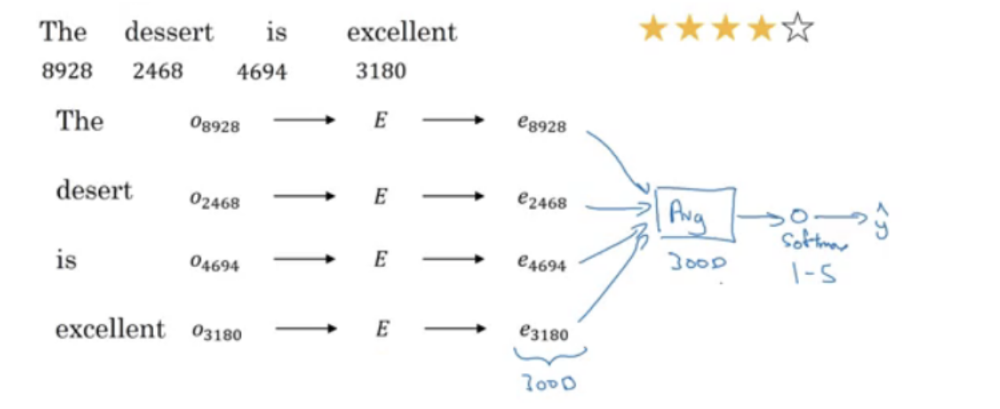

- The basic sentiment classification model starts with choosing a context and a target from a sentence. For instance, "I want a glass of orange juice to go along with my cereal" could be used as an input.
- A simple model involves creating embeddings for each word in the sentence. This could involve using an embedding matrix that has been trained on a much larger corpus, such as 100 billion words.
- The number of features in the word embedding is typically around 300.
- The embeddings for each word in a sentence are then aggregated using a sum or average to create a single vector representation of the sentence.
- This vector is passed through a softmax classifier to predict the sentiment.

#### Challenges with Simple Models

- A significant limitation of this approach is its ignorance of word order. For example, repeating the word "good" in a negative review ("Completely lacking in good taste, good service, and good ambiance") could be misleading for the model.

### RNN for Sentiment Classification
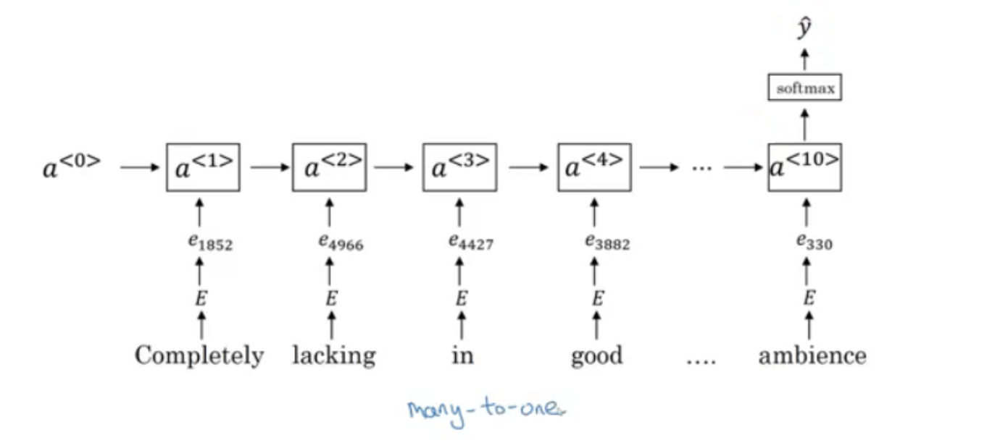
- A more advanced model uses a Recurrent Neural Network (RNN) to account for word order in the sentence.
- RNNs process the sentence word by word, carrying forward context information through hidden states.
- This allows the RNN to capture the sequential nature and semantics of the sentence better.
- Training such an RNN model results in a more accurate sentiment classification algorithm, especially for sentences where the meaning is highly dependent on the order of the words.

#### Debiasing word embeddings

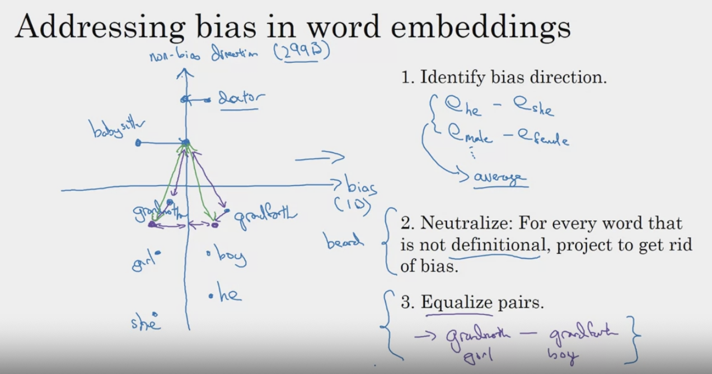