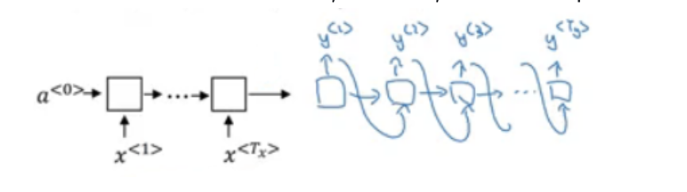
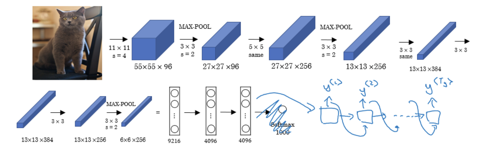
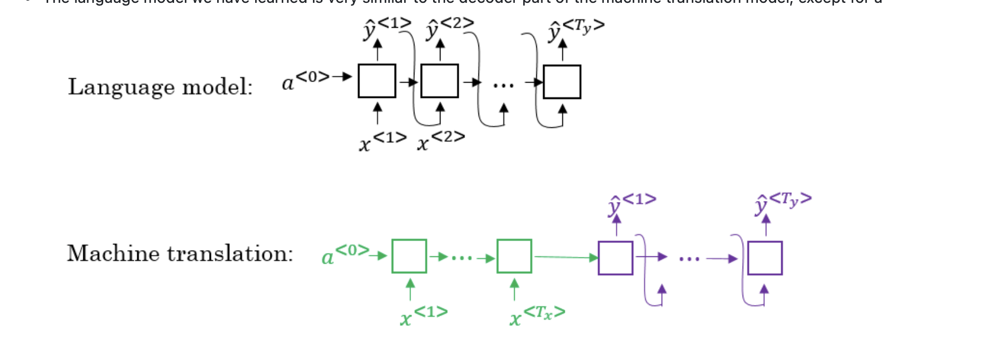
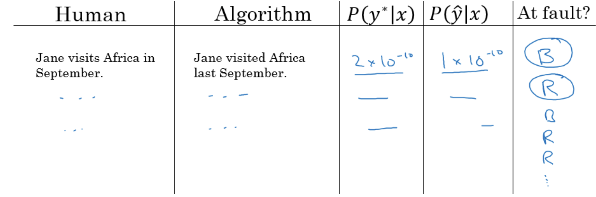
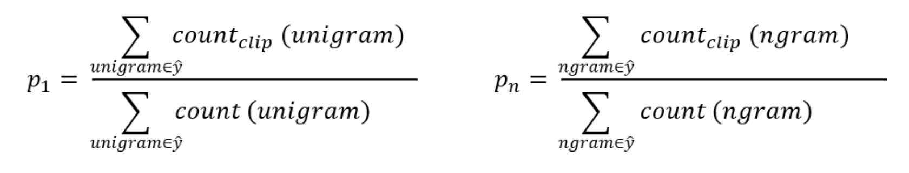
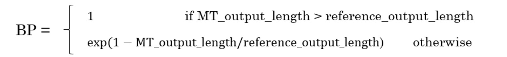
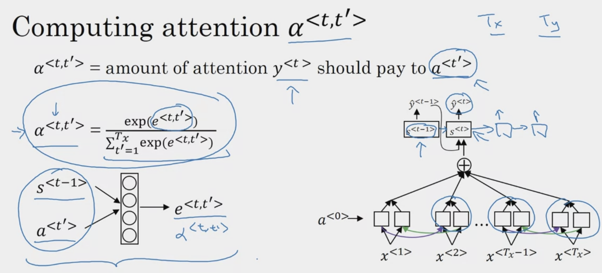

# Sequence models & Attention mechanism

## Various sequence to sequence architectures
- Many to Many - models which are useful in various applications including machine translation and speech recognition.
- Our architecture will include encoder and decoder.
- The encoder is RNN - LSTM or GRU are included - and takes the input sequence and then outputs a vector that should represent the whole input.
- After that the decoder network, also RNN, takes the sequence built by the encoder and outputs the new sequence.

- Text to Text
    -

- Image to Text
    -

## Picking The Most Likely Sentence
- When creating word embeddings and training language models, we typically focus on an artificial task like estimating $ P(\text{target} | \text{context}) $. The objective is not to perform this task perfectly, but to develop a robust set of word embeddings that capture the nuanced relationships between words.

## Language Model vs. Machine Translation Model

- **Language Model**: Aims to predict the next word in a sentence. It resembles the decoder part of a machine translation model, excluding the initial context vector `a<0>`.
- **Machine Translation Model**: Translates a sentence from one language to another, taking into account the entire sequence of input words.

## Problem Formulation

- **Language Model**: Probability of a sentence is denoted as $ P(y^{<1>}, \ldots, y^{<T_{y}>}) $.
- **Machine Translation**: Probability of a translated sentence given the original sentence is $ P(y^{<1>}, \ldots, y^{<T_{y>}} | x^{<1>}, \ldots, x^{<T_{x>}}) $.

## Selecting the Most Probable Translation

- In machine translation, we strive to choose the translation with the highest probability.
- However, a simple greedy approach can lead to suboptimal results due to local optimization.
- Instead, algorithms like beam search are employed to approximate the most likely sentence.

### Greedy Search Limitations

- Greedy search selects the most probable next word at each step but can miss the globally optimal sequence.
- Example: A sentence "Jane visite l'Afrique en septembre." can have multiple translations, and the greedy method might pick a less coherent one.

### Beam Search Strategy
- Beam search is the most widely used algorithm to get the best output sequence. It's a heuristic search algorithm.
- To illustrate the algorithm we will stick with the example from the previous section. We need Y = "Jane is visiting Africa in September."
- The algorithm has a parameter `B` which is the beam width. Lets take `B = 3` which means the algorithm will get 3 outputs at a time.
- For the first step you will get ["in", "jane", "september"] words that are the best candidates.
- Then for each word in the first output, get B next (second) words and select top best B combinations where the best are those what give the highest value of multiplying both probabilities - $P(y^{<1>}|x) * P(y^{<2>}|x,y^{<1>})$. Se we will have then ["in september", "jane is", "jane visit"]. Notice, that we automatically discard september as a first word.
- Repeat the same process and get the best B words for ["september", "is", "visit"] and so on.
- In this algorithm, keep only B instances of your network.
- If `B = 1` this will become the greedy search.

#### Beam Search Refine

##### Length Normalization

- To mitigate the problem of multiplying numerous small probabilities, which can cause numerical underflow, we use the sum of log probabilities instead:

    - $arg max ∑ log (P(y^{<t>} | x, y^{<1>}, ..., y^{<t-1>}))$

- However, without adjustment, this approach favors shorter sequences. To counter this, we introduce length normalization:

    - $arg max (\frac{1}{T_y^{α}}) * \sum log (P(y^{<t>} | x, y^{<1>}, ..., y^{<t-1>}))$

- Detail: 
    - $α$ is a hyperparameter for tuning the degree of length normalization.
    - Setting $α$ to 0 results in no normalization, while $α$ set to 1 applies full normalization. A common practice is to set $α$ around 0.7 for a balanced approach.

##### Beam Selection
- The larger B - the larger possibilities, the better are the results. But it will be more computationally expensive.
    - In practice, you might see in the production setting B=10
    - B=100, B=1000 are uncommon (sometimes used in research settings)
    - Unlike exact search algorithms like BFS (Breadth First Search) or DFS (Depth First Search), Beam Search runs faster but is not guaranteed to find the exact solution.

### Error analysis in beam search

- `B` for beam search, `R` is for the RNN.
- In machine learning models, especially those involving sequence predictions like machine translation with RNNs, it's crucial to determine the source of errors to make appropriate adjustments. One critical aspect to analyze is whether the beam search hyperparameter `B` or the RNN itself contributes to suboptimal results.

#### Example Case for Analysis

Consider the translation task where:
- The input sentence (X) is: "Jane visite l'Afrique en septembre."
- The correct translation (Y*) is: "Jane visits Africa in September."
- The produced translation (Ŷ) is: "Jane visited Africa last September."

The model has not produced the desired result, and we aim to find out which component is responsible for the error.

#### Determining the Error Source

To ascertain whether the RNN or the beam search is at fault, we compare the probabilities:

- Case 1: If $P(Y* | X) > P(\hat{Y} | X) $:
  - **Conclusion**: Beam search is at fault for choosing a less likely sentence.

- Case 2: If $P(Y* | X) \leq P(\hat{Y} | X) $:
  - **Conclusion**: The RNN model is at fault for assigning a higher probability to the incorrect sentence.

## BLEU Score
- The BLEU (Bilingual Evaluation Understudy) score is a metric used to evaluate the quality of text which has been machine-translated from one language to another. Here's a summary of the key points from the images you've provided:

- BLEU score on bigrams
  - The **n-grams** typically are collected from a text or speech corpus. When the items are words, **n-grams** may also be called shingles. An **n-gram** of size 1 is referred to as a "unigram"; size 2 is a "bigram" (or, less commonly, a "digram"); size 3 is a "trigram".
  - X = "Le chat est sur le tapis."
  - Y1 = "The cat is on the mat."
  - Y2 = "There is a cat on the mat."
  - Suppose that the machine outputs: "the cat the cat on the mat."
  - The bigrams in the machine output:
  
    | Pairs      | Count | Count clip |
    | ---------- | ----- | ---------- |
    | the cat    | 2     | 1 (Y1)     |
    | cat the    | 1     | 0          |
    | cat on     | 1     | 1 (Y2)     |
    | on the     | 1     | 1 (Y1)     |
    | the mat    | 1     | 1 (Y1)     |
    | **Totals** | 6     | 4          |

    Modified precision = sum(Count clip) / sum(Count) = 4/6
- So here are the equations for modified precision for the n-grams case:   
  
- Let's put this together to formalize the BLEU score:
  - **Pn** = Bleu score on one type of n-gram
  - $Combined\space BLEU\space Score\space =\space BP\space *\space e^{\frac{1}{n}\space *\space \sum{P_{n}}}$
    - For example if we want BLEU for 4, we compute P1, P2, P3, P4 and then average them and take the exp.
  - **BP** is called **BP penalty** which stands for brevity penalty. It turns out that if a machine outputs a small number of words it will get a better score so we need to handle that.   
    
- BLEU score has several open source implementations. 
- It is used in a variety of systems like machine translation and image captioning.

## Attention Model
- Attention Models were created to address the limitations of Recurrent Neural Networks (RNNs) and Long Short-Term Memory networks (LSTMs) in processing long sequences of data. They help the model to focus on specific parts of the input sequence when predicting a part of the output sequence, rather like how humans pay attention to specific details when understanding a sentence or an image.

